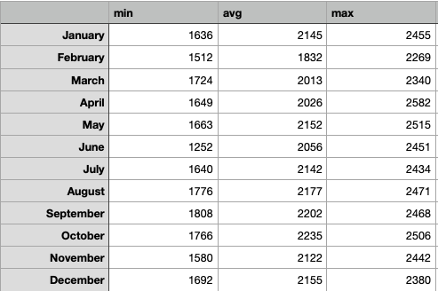
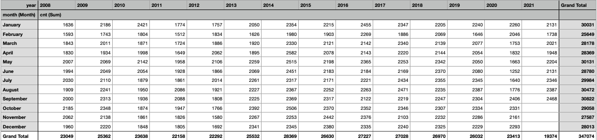
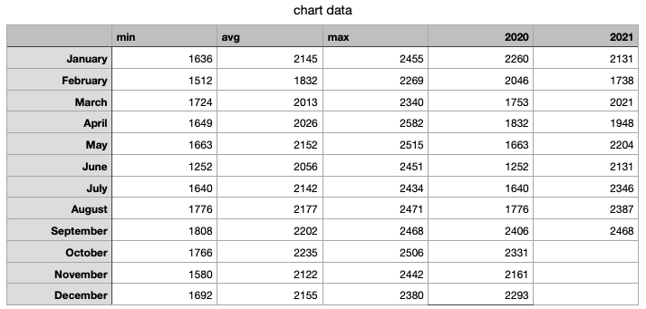
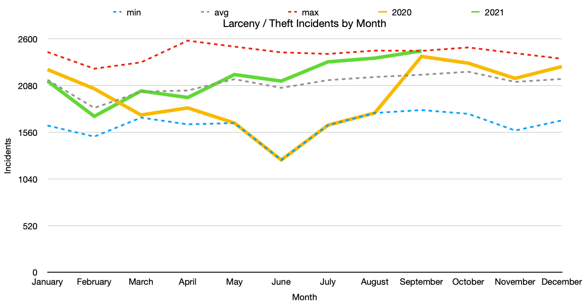

# Administrative Analysis Walkthrough

Administrative Analysis for IMPD is difficult from the amount of available public information. CityProtect only allows 12 months of data to be queried from the API so I cannot do year over year comparisons with it.

## Data Cleaning and Setup
I found a great dataset for Seattle from [here](https://data.seattle.gov/Public-Safety/SPD-Crime-Data-2008-Present/tazs-3rd5) that includes crime data from 2008 to Present. However due to the massive size (over 100MB), I decided to import it into MySQL for better manipulation.
```sql
-- connect via mysql -u root -p --local-infile

-- create table
-- dates are not in proper format so varchar for now
CREATE TABLE crime (
report_number varchar(50),
offense_id varchar(30),
offense_start varchar(50),
offense_end varchar(50),
report varchar(50),
group_a_b varchar(5),
crime_cat varchar(50),
offense_parent varchar(100),
offense varchar(100),
offense_code varchar(5),
precinct varchar(5),
sector varchar(5),
beat varchar(5),
mcpp varchar (60),
address varchar(150),
longitude float,
latitude float
);

-- load the csv
LOAD DATA INFILE '/tmp/crime.csv' IGNORE 
INTO TABLE crime
IGNORE 1
FIELDS TERMINATED BY ',' 
LINES TERMINATED BY '\n'

-- convert the report col to proper datetime
UPDATE crime set report = STR_TO_DATE(report, '%m/%d/%Y %r');

-- query of LARCENY-THEFT incidents over time
select 
    DATE_FORMAT(report, '%m') month_o, 
    DATE_FORMAT(report, '%b') month,  
    DATE_FORMAT(report, '%Y') year, 
    count(report_number) as cnt 
FROM crime
WHERE offense_parent = 'LARCENY-THEFT'

GROUP BY DATE_FORMAT(report, '%m'), DATE_FORMAT(report, '%b'), DATE_FORMAT(report, '%Y')

ORDER BY DATE_FORMAT(report, '%Y'), DATE_FORMAT(report, '%m') ;
```

I do not have Excel installed, but my MacBook comes with Apple Numbers so I imported this raw data into there like so:


I needed two things, a table of min/avg/max for each month and for the past two years to chart.

For the min/avg/max, a table with the months as rows and measurement as columns works:


The formulas for the first row look like the following:
```
# raw_data_table is the SQL output from above query
# $A2 is January from the table in the above image

# min
MINIFS(raw_data_table::cnt,raw_data_table::A,$A2)

# avg
AVERAGEIFS(raw_data_table::cnt,raw_data_table::A,$A2)

# max
MAXIFS(raw_data_table::cnt,raw_data_table::A,$A2)
```

Essentially, it does a min, average and max only if the month name from this table matches the month name from the SQL output table.

I also created a pivot table to easily get the count per month for the past two years (large table, might be hard to see):


Last thing to do is merge the statistics with a few years from the pivot like so:


And plot it in a line chart:


All of this data is from Jan 2008 to Present so we are looking at min, avg and max for 13 years.

We can see in May-August of 2020 was a record 13-year low for theft incidents, however we can probably estimate this is due to the COVID19 pandemic and associated lockdowns.

September 2021 also happens to be the 13 year peak of theft incidents.

Theft Incidents in Seattle appear to closely follow the average until June where they start to increase well above average. Unless another lockdown is imposed, we could predict for higher than average theft incidents for the remainder of 2021. Tactical Analysis could be used here to see if there are any patterns to the increase in thefts and if so, police could be mobilized to the affected areas.
