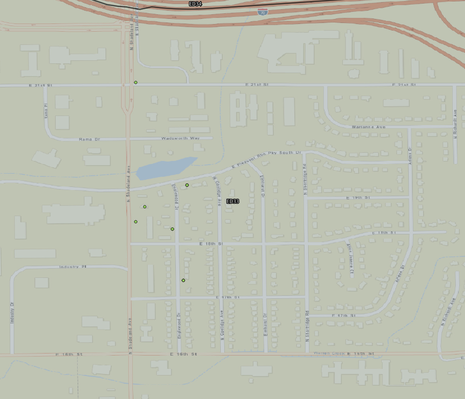

# Tactical Analysis

Between the hours of 1633 hrs on 6 Sep 2021 and 2007 hrs on 11 Sep 2021, IMPD officers were dispatched 7 times and 5 reports were filed for burglary / breaking and entering.

As seen in the image above, all of the incidents occured in IMPD East District 33 all centered around the 1800 Block of ENGLEWOOD DR. All incidents occurred less than 1000 feet of each other and within 7 days of each other which could indicate a crime spree from the same individual or team.

My data for further analysis is impeded by the limited information provided from my extract of CityProtect data (which could also be modified from true source data) and also a lack of any other information sources that could help discover more information such as critical report details that could help tie the events together such as similar entry points, similar items stolen, similar method of breaking/entering, or similar suspect descriptions.

