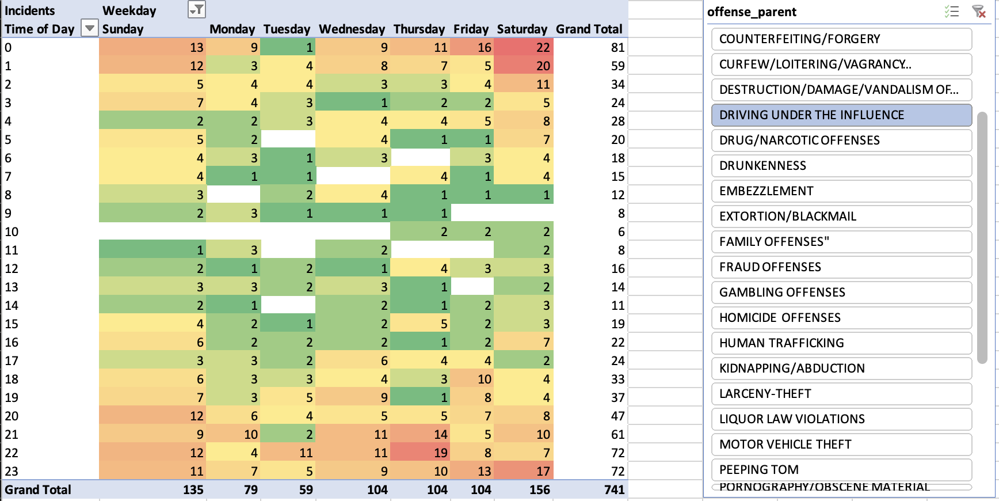

# Temporal Analysis
Using the Seattle Crime Data that I also used and setup from the [Administrative Analysis](./AdministrativeAnalysis.md) walkthrough and analysis.

For this particular analysis, I used the following SQL query to grab all data for 2021 and imported the raw data into Excel for further manipulation:
```sql
select * from crime where DATE_FORMAT(report, '%Y')  = '2021'
```

In Excel, I created four new columns to break the `offense_start` column into parts: day, month, year, hour:

Select the entire dataset and then I created a pivot table with weekday as columns and hour as rows. We can also use a slicer to filter down to a category such as LARCENY-THEFT:

From this example, midnight on essentially every day of the week is peak time for larceny or theft offense start times, with Monday morning being the highest for 2021.

Another example is Driving under the Influence (DUI) for 2021:


Here we can see Saturday at midnight is the peak, which would make sense as many workers getting off work for the weekend Friday night. COVID guidance through June 30th 2021 was any place that served alcohol was to close at 12a, [per this document](https://www.governor.wa.gov/sites/default/files/COVID19%20Eating%20and%20Drinking%20Establishment%20Guidance.pdf). So with bars closing and people leaving after a fun-filled Friday night, it would be a plausible theory as to why the DUI incidents peak on Saturday morning.


Slicers can also be chained together, for instance we can check for hotsports of Burglary but narrow it down by beat:

Burglary in beat B1

Burglary in beat C1

For beat B1, Saturday at Midnight has the overwhelming peak for burglary or breaking and entering incidents. However for beat C1, Tuesday at midnight is the hotspot. Doing a drilldown into beat would help station officers correctly to try and prevent or catch crime in the act. Pairing this information with addresses or GIS data can further drilldown hotspots of where officers could actually be stationed to help mitigate further issues.
